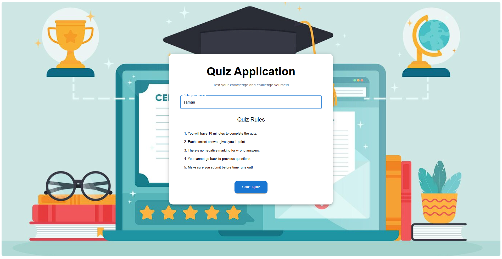
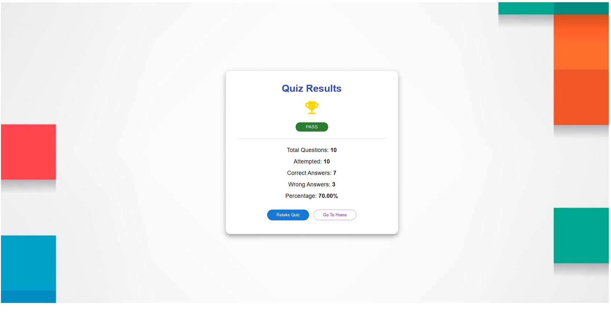

# 📝 Online Exam App – MERN Stack Web Application

📌 **Overview**  
Online Exam App is a modern, full-stack web application designed to simplify the online examination process for students and administrators.  
It enables students to register, log in, take timed exams, and receive instant results, while administrators can create exams, manage questions, and monitor exam performance.  
This project showcases practical full-stack development skills using the MERN stack and addresses real-world challenges in building scalable, secure online platforms.

---

🚀 **Key Features**  

🖥️ **User-Friendly Interface**  
Modern, responsive UI built with React and Material-UI for an engaging user experience.

📝 **Online Examination System**  
Timed exams with automatic submission, real-time progress tracking, and instant result calculation.

💾 **Backend Integration**  
Node.js and Express backend connected to a MongoDB database for seamless data management.

🔗 **RESTful API Architecture**  
Well-structured, scalable API endpoints to handle all application operations.

---

💻 **Technologies Used**  

- **Frontend** → React, Material-UI, Axios, React Router  
- **Backend** → Node.js, Express.js, REST APIs  
- **Database** → MongoDB with Mongoose  
- **Version Control** → Git, GitHub  
- **Design Patterns** → Applied best practices for clean, maintainable code

---

🖼️ **Screenshots**  

##  Home page
 
##  Quiz page
 
##  Result page

---

